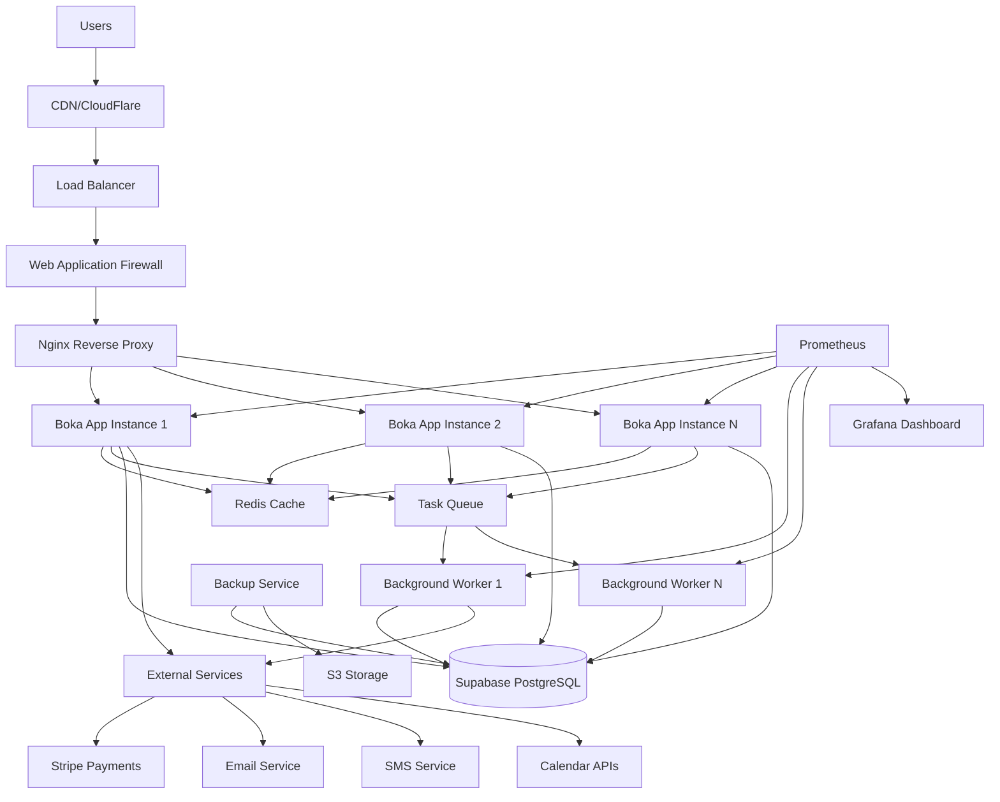
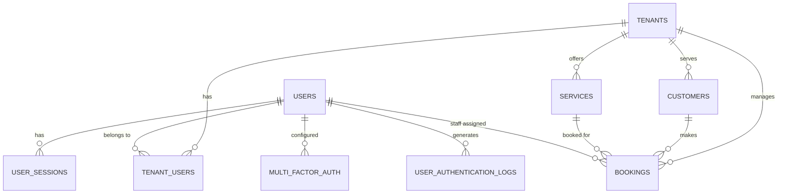
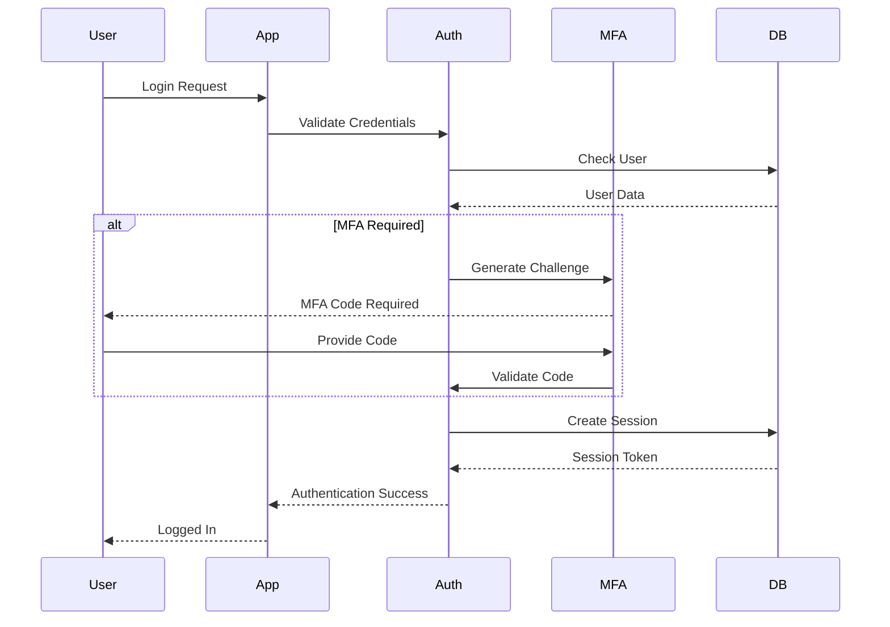
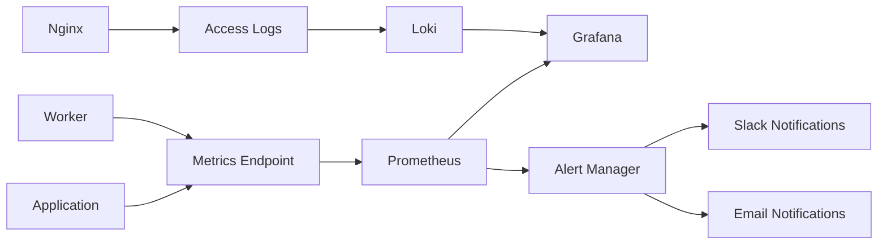

# Boka Booking System - Architecture Documentation

## System Architecture Overview

The Boka booking system is designed as a modern, cloud-native application with enterprise-grade security, scalability, and reliability. The architecture follows microservices principles while maintaining simplicity for operations and development.

## High-Level Architecture



## Technology Stack

### Frontend Layer
- **Framework**: Next.js 14+ with App Router
- **Language**: TypeScript
- **Styling**: Tailwind CSS
- **UI Components**: Custom components + shadcn/ui
- **State Management**: Zustand
- **Forms**: React Hook Form with Zod validation

### Backend Layer
- **Runtime**: Node.js 18+
- **Framework**: Next.js API Routes
- **Language**: TypeScript
- **Authentication**: Enhanced custom auth with MFA
- **Authorization**: Role-based access control (RBAC)
- **Validation**: Zod schemas

### Database Layer
- **Primary Database**: Supabase (PostgreSQL 14+)
- **Security**: Row Level Security (RLS)
- **Migrations**: Supabase CLI
- **Backup**: Automated daily/weekly/monthly

### Caching Layer
- **Cache**: Redis 7+
- **Session Storage**: Redis
- **Rate Limiting**: Redis-based
- **Queue**: Redis-based task queue

### Infrastructure Layer
- **Containerization**: Docker & Docker Compose
- **Reverse Proxy**: Nginx
- **SSL/TLS**: Let's Encrypt or custom certificates
- **Monitoring**: Prometheus + Grafana
- **Logging**: Structured JSON logs

### External Services
- **Payments**: Stripe
- **Email**: SendGrid or similar
- **SMS**: Twilio
- **Calendar**: Google Calendar / Outlook
- **File Storage**: Supabase Storage or S3

## Core Components

### 1. Authentication System

#### Enhanced Authentication Service (`/lib/auth/enhanced-auth.ts`)

**Responsibilities:**
- User authentication and authorization
- Multi-factor authentication (MFA)
- Session management
- API key management
- Security monitoring and audit logging
- Account lockout protection

**Key Features:**
- TOTP-based MFA with backup codes
- Enhanced session management with device tracking
- Comprehensive audit logging
- API key management with scopes and rate limiting
- Security metrics and monitoring
- Automatic cleanup of expired sessions

**Database Tables:**
- `user_authentication_logs` - Audit trail of all auth events
- `user_sessions` - Enhanced session management
- `multi_factor_auth` - MFA configurations
- `security_settings` - Per-user security preferences
- `account_lockout` - Account lockout management
- `api_keys` - API key management
- `api_key_usage` - API usage tracking

### 2. Authorization Middleware (`/lib/auth/auth-middleware.ts`)

**Responsibilities:**
- Request authentication and authorization
- Rate limiting enforcement
- Security validations (IP restrictions, device fingerprinting)
- Session validation and refresh
- API key validation

**Features:**
- Multiple authentication methods (session, Bearer token, API key)
- Configurable rate limiting per endpoint type
- Suspicious activity detection
- Role-based access control
- Security headers injection

### 3. Booking Engine (`/lib/booking/booking-engine.ts`)

**Responsibilities:**
- Core booking logic and state management
- Availability calculations
- Pricing and discounts
- Booking validation and constraints
- Integration with external calendar systems

**Key Features:**
- Real-time availability checking
- Complex pricing rules and discounts
- Booking conflict detection
- Resource optimization algorithms
- Calendar synchronization

### 4. Payment Processing (`/lib/payments/payment-lifecycle.ts`)

**Responsibilities:**
- Payment processing workflow
- Transaction management
- Refund and cancellation handling
- Payment method management
- Compliance and security

**Features:**
- Multi-provider payment support (Stripe primary)
- Secure payment data handling (PCI compliance)
- Automated refund processing
- Payment retry logic
- Transaction audit trail

### 5. Event Bus System (`/lib/eventbus/eventBus.ts`)

**Responsibilities:**
- Asynchronous event processing
- Service decoupling
- Event persistence and reliability
- Integration with external systems

**Features:**
- Reliable event delivery
- Event ordering and deduplication
- Dead letter queue handling
- Event replay capabilities
- Integration hooks for external systems

### 6. Observability (`/lib/observability/observability.ts`)

**Responsibilities:**
- Application metrics collection
- Distributed tracing
- Performance monitoring
- Business metrics tracking
- Error tracking and alerting

**Features:**
- Prometheus metrics export
- Structured logging
- Request tracing
- Custom business metrics
- Real-time dashboards

### 7. Worker Queue System (`/lib/worker/enhanced-worker.ts`)

**Responsibilities:**
- Background job processing
- Scheduled task execution
- Email and SMS notifications
- Data synchronization
- Maintenance tasks

**Features:**
- Reliable job processing
- Job retry with exponential backoff
- Job prioritization
- Dead letter queue
- Job monitoring and metrics

## Data Architecture

### Database Schema

#### Core Entities

```sql
-- Tenants (Multi-tenancy support)
tenants (
  id UUID PRIMARY KEY,
  name TEXT NOT NULL,
  domain TEXT UNIQUE,
  settings JSONB,
  created_at TIMESTAMP DEFAULT NOW()
);

-- Users
users (
  id UUID PRIMARY KEY,
  email TEXT UNIQUE NOT NULL,
  password_hash TEXT,
  created_at TIMESTAMP DEFAULT NOW()
);

-- Tenant-User Relationships
tenant_users (
  id UUID PRIMARY KEY,
  tenant_id UUID REFERENCES tenants(id),
  user_id UUID REFERENCES users(id),
  role TEXT NOT NULL,
  permissions JSONB,
  created_at TIMESTAMP DEFAULT NOW()
);

-- Services
services (
  id UUID PRIMARY KEY,
  tenant_id UUID REFERENCES tenants(id),
  name TEXT NOT NULL,
  description TEXT,
  duration_minutes INTEGER NOT NULL,
  price_cents INTEGER NOT NULL,
  settings JSONB,
  created_at TIMESTAMP DEFAULT NOW()
);

-- Customers
customers (
  id UUID PRIMARY KEY,
  tenant_id UUID REFERENCES tenants(id),
  email TEXT NOT NULL,
  first_name TEXT,
  last_name TEXT,
  phone TEXT,
  preferences JSONB,
  created_at TIMESTAMP DEFAULT NOW()
);

-- Bookings
bookings (
  id UUID PRIMARY KEY,
  tenant_id UUID REFERENCES tenants(id),
  customer_id UUID REFERENCES customers(id),
  service_id UUID REFERENCES services(id),
  staff_id UUID REFERENCES users(id),
  status booking_status NOT NULL DEFAULT 'pending',
  start_time TIMESTAMP NOT NULL,
  end_time TIMESTAMP NOT NULL,
  price_cents INTEGER NOT NULL,
  notes TEXT,
  metadata JSONB,
  created_at TIMESTAMP DEFAULT NOW()
);
```

#### Security and Audit Tables

```sql
-- Authentication logs
user_authentication_logs (
  id UUID PRIMARY KEY,
  user_id UUID REFERENCES users(id),
  event_type TEXT NOT NULL,
  ip_address INET,
  user_agent TEXT,
  success BOOLEAN NOT NULL,
  failure_reason TEXT,
  metadata JSONB,
  created_at TIMESTAMP DEFAULT NOW()
);

-- Enhanced sessions
user_sessions (
  id UUID PRIMARY KEY,
  session_token TEXT UNIQUE NOT NULL,
  user_id UUID REFERENCES users(id),
  tenant_id UUID REFERENCES tenants(id),
  ip_address INET,
  user_agent TEXT,
  device_fingerprint TEXT,
  is_active BOOLEAN DEFAULT true,
  expires_at TIMESTAMP NOT NULL,
  metadata JSONB,
  created_at TIMESTAMP DEFAULT NOW()
);

-- Multi-factor authentication
multi_factor_auth (
  id UUID PRIMARY KEY,
  user_id UUID REFERENCES users(id),
  method mfa_method NOT NULL,
  secret_encrypted TEXT,
  backup_codes_encrypted TEXT,
  is_primary BOOLEAN DEFAULT false,
  is_enabled BOOLEAN DEFAULT false,
  verified_at TIMESTAMP,
  last_used_at TIMESTAMP,
  failure_count INTEGER DEFAULT 0,
  blocked_until TIMESTAMP,
  created_at TIMESTAMP DEFAULT NOW()
);
```

### Row Level Security (RLS)

All tables implement comprehensive RLS policies for multi-tenant data isolation:

```sql
-- Example RLS policy for bookings
CREATE POLICY "tenant_isolation_bookings" ON bookings
  FOR ALL USING (
    tenant_id = (
      SELECT tenant_id FROM tenant_users 
      WHERE user_id = auth.uid() 
      LIMIT 1
    )
  );
```

### Data Relationships



## Security Architecture

### Security Layers

1. **Infrastructure Security**
   - WAF (Web Application Firewall)
   - DDoS protection
   - SSL/TLS encryption
   - Network segmentation

2. **Application Security**
   - Input validation (Zod schemas)
   - SQL injection prevention (parameterized queries)
   - XSS protection (CSP headers)
   - CSRF protection

3. **Authentication & Authorization**
   - Multi-factor authentication
   - Role-based access control
   - API key management
   - Session security

4. **Data Security**
   - Row Level Security (RLS)
   - Data encryption at rest
   - PII data handling
   - Audit logging

### Security Controls

#### Authentication Flow



#### Authorization Matrix

| Role | Booking Create | Booking View | User Manage | Service Manage | Analytics |
|------|---------------|--------------|-------------|----------------|-----------|
| Customer | Own only | Own only | Own profile | ❌ | ❌ |
| Staff | ✅ | Assigned | Own profile | View only | Basic |
| Manager | ✅ | All tenant | Tenant users | ✅ | Advanced |
| Owner | ✅ | All tenant | All tenant | ✅ | Full |
| SuperAdmin | ✅ | All system | All system | All system | Full |

## API Architecture

### RESTful API Design

The API follows REST principles with consistent resource naming and HTTP methods:

```
GET    /api/v1/bookings           # List bookings
POST   /api/v1/bookings           # Create booking
GET    /api/v1/bookings/{id}      # Get booking
PUT    /api/v1/bookings/{id}      # Update booking
DELETE /api/v1/bookings/{id}      # Cancel booking
```

### API Versioning

- **Version Strategy**: URL path versioning (`/api/v1/`)
- **Backward Compatibility**: Maintained for at least 2 major versions
- **Deprecation**: 6-month notice period

### Error Handling

Standardized error responses:

```json
{
  "error": "Validation failed",
  "code": "VALIDATION_ERROR",
  "details": {
    "field": "start_time",
    "message": "Start time must be in the future"
  },
  "timestamp": "2024-01-01T00:00:00.000Z",
  "request_id": "req_abc123"
}
```

### Rate Limiting

- **Authentication endpoints**: 5 requests/minute per IP
- **General API**: 1000 requests/hour per API key
- **Admin endpoints**: 100 requests/hour
- **Webhooks**: No rate limiting

## Performance Architecture

### Caching Strategy

1. **Application Cache** (Redis)
   - Session data
   - API responses
   - Query results
   - Rate limiting counters

2. **Database Query Optimization**
   - Proper indexing strategy
   - Connection pooling
   - Query analysis and optimization

3. **Static Asset Caching**
   - CDN for static assets
   - Browser caching headers
   - Asset versioning

### Scaling Strategy

#### Horizontal Scaling

- **Stateless application design**
- **Load balancing** across multiple instances
- **Database connection pooling**
- **Shared cache** (Redis)

#### Performance Monitoring

- **Response time tracking**
- **Database query performance**
- **Cache hit rates**
- **Resource utilization**

## Deployment Architecture

### Container Strategy

```dockerfile
# Multi-stage build
FROM node:18-alpine AS dependencies
# Install dependencies

FROM node:18-alpine AS builder  
# Build application

FROM node:18-alpine AS production
# Production runtime
```

### Environment Management

- **Development**: Local Docker Compose
- **Staging**: Cloud deployment (preview)
- **Production**: Cloud deployment (multi-region)

### Infrastructure as Code

- **Docker Compose**: Local and staging environments
- **Kubernetes**: Production scaling (future)
- **Terraform**: Cloud infrastructure provisioning

## Monitoring and Observability

### Metrics Collection



### Key Metrics

#### Technical Metrics
- Request rate and latency
- Error rates
- Database performance
- Cache performance
- Resource utilization

#### Business Metrics
- Booking creation rate
- Payment success rate
- User authentication events
- Feature usage statistics

### Alerting Strategy

#### Critical Alerts (Immediate Response)
- Application down
- Database connectivity issues
- High error rates (>5%)
- Security incidents

#### Warning Alerts (Monitor)
- High resource usage (>80%)
- Slow response times
- Low cache hit rates
- Payment processing delays

## Disaster Recovery

### Backup Strategy

1. **Database Backups**
   - Daily automated backups
   - Cross-region replication
   - Point-in-time recovery

2. **Application Backups**
   - Configuration files
   - SSL certificates
   - Docker images

3. **Testing**
   - Monthly restore tests
   - Disaster recovery drills
   - Documentation updates

### Recovery Procedures

#### RTO/RPO Targets
- **Recovery Time Objective (RTO)**: 15 minutes
- **Recovery Point Objective (RPO)**: 1 hour

#### Failover Strategy
1. Automatic health check monitoring
2. DNS failover to backup region
3. Data replication verification
4. Service restoration validation

## Future Architecture Considerations

### Microservices Migration

Potential service boundaries:
- **User Service**: Authentication and user management
- **Booking Service**: Core booking logic
- **Payment Service**: Payment processing
- **Notification Service**: Email/SMS notifications
- **Analytics Service**: Reporting and analytics

### Event-Driven Architecture

Enhanced event streaming:
- Apache Kafka for event streaming
- Event sourcing for audit trail
- CQRS for read/write separation

### Multi-Region Deployment

- Global load balancing
- Data replication strategies
- Compliance considerations (GDPR, etc.)

---

*This architecture documentation should be updated with major system changes. Last updated: [date]*